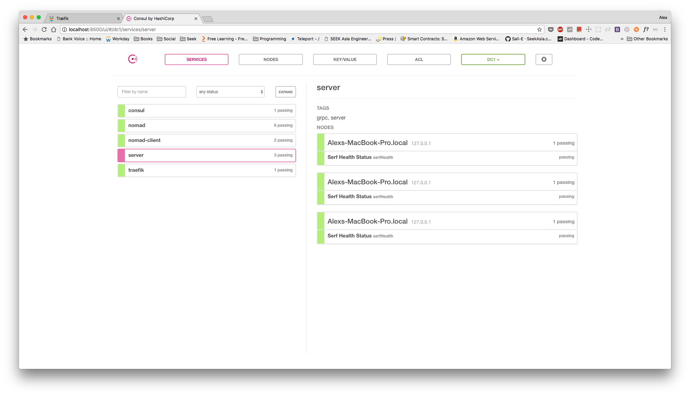
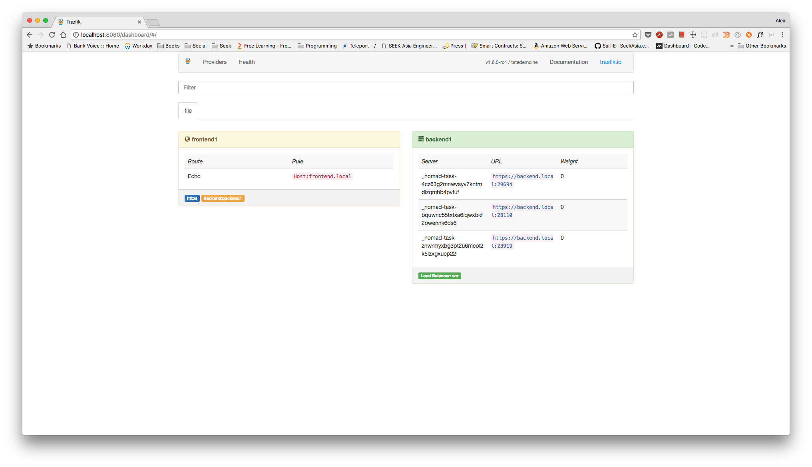

# traefik-grpc
gRPC load balancing with Traefik. The README is heavily inspired from [traefik docs](https://docs.traefik.io/user-guide/grpc/).

## Prerequisite

As gRPC needs HTTP2, we need valid HTTPS certificates on both gRPC Server and Træfik.

## Creating gRPC Server Certificate

```bash
$ openssl req -x509 -nodes -days 365 -newkey rsa:2048 -keyout ./backend.key -out ./backend.cert
```

That will prompt for information, the important answer is:

```
Common Name (e.g. server FQDN or YOUR name) []: backend.local
```

## Creating gRPC Client Certificate

```bash
$ openssl req -x509 -nodes -days 365 -newkey rsa:2048 -keyout ./frontend.key -out ./frontend.cert
```

with:

```
Common Name (e.g. server FQDN or YOUR name) []: frontend.local
```

## Traefik Configuration

At last, we configure our Træfik instance to use both self-signed certificates.

```toml
defaultEntryPoints = ["https"]

# For secure connection on backend.local
RootCAs = [ "./backend.cert" ]

[entryPoints]
  [entryPoints.https]
  address = ":4443"
    [entryPoints.https.tls]
     # For secure connection on frontend.local
     [[entryPoints.https.tls.certificates]]
     certFile = "./frontend.cert"
     keyFile  = "./frontend.key"


[web]
  address = ":8080"

[file]

[backends]
  [backends.backend1]
    [backends.backend1.servers.server1]
    # Access on backend with HTTPS (the port is the gRPC server port)
    url = "https://backend.local:50051"


[frontends]
  [frontends.frontend1]
  backend = "backend1"
    [frontends.frontend1.routes.test_1]
    rule = "Host:frontend.local"
```

## gRPC Server Example

```go
// ...

// Read cert and key file
BackendCert, _ := ioutil.ReadFile("./backend.cert")
BackendKey, _ := ioutil.ReadFile("./backend.key")

// Generate Certificate struct
cert, err := tls.X509KeyPair(BackendCert, BackendKey)
if err != nil {
  log.Fatalf("failed to parse certificate: %v", err)
}

// Create credentials
creds := credentials.NewServerTLSFromCert(&cert)

// Use Credentials in gRPC server options
serverOption := grpc.Creds(creds)
var s *grpc.Server = grpc.NewServer(serverOption)
defer s.Stop()

pb.RegisterGreeterServer(s, &server{})
err := s.Serve(lis)

// ...
```

## gRPC Client Example

```go
// ...

// Read cert file
FrontendCert, _ := ioutil.ReadFile("./frontend.cert")

// Create CertPool
roots := x509.NewCertPool()
roots.AppendCertsFromPEM(FrontendCert)

// Create credentials
credsClient := credentials.NewClientTLSFromCert(roots, "")

// Dial with specific Transport (with credentials)
conn, err := grpc.Dial("frontend.local:4443", grpc.WithTransportCredentials(credsClient))
if err != nil {
    log.Fatalf("did not connect: %v", err)
}

defer conn.Close()
client := pb.NewGreeterClient(conn)

name := "World"
r, err := client.SayHello(context.Background(), &pb.HelloRequest{Name: name})

// ...
```


## Starting Traefik

You need `sudo` permission in order to run `traefik`:
```
$ sudo ./traefik_darwin-amd64 --configFile=./traefik.toml
```

## Setting local hostname

```bash
$ cat /etc/hosts

# Edit the host name
$ sudo vi /etc/hosts

# Clear the local DNS cache on macOS Sierra
$ sudo killall -HUP mDNSResponder
```

Output:
```bash
##
# Host Database
#
# localhost is used to configure the loopback interface
# when the system is booting.  Do not change this entry.
##
127.0.0.1	localhost
255.255.255.255	broadcasthost
::1             localhost

# Include this two lines to make it work
127.0.0.1	backend.local frontend.local
```

## Steps for test
After all the above has been finished, then you can test by the steps below:

```bash
# Make sure that you are in the correct directory.
$ pwd
$GOPATH/src/github.com/alextanhongpin/traefik-grpc

# Run the grpc server
go run server/main.go

# Run the grpc client in another terminal
go run client/main.go
```


## NEW

Setup nomad and consul:

```bash
# Sudo is required for traefik to bind to port 80
$ sudo nomad agent -dev -data-dir=$PWD/nomad
$ sudo consul agent -dev
```

Run nomad job:

```bash
$ nomad plan grpc.nomad
```

View the UI:





Call the gRPC client multiple times - it will be load balanced across different ports:

```bash
$ ./client/client
2018/04/07 12:52:07 got res: &echo.EchoResponse{Text:"hello world hostname: Alexs-MacBook-Pro.local port: 23919"}

$ ./client/client                        
2018/04/07 12:52:12 got res: &echo.EchoResponse{Text:"hello world hostname: Alexs-MacBook-Pro.local port: 29694"}
```

Todo: The current version doesn't listen to restart in consul configuration yet